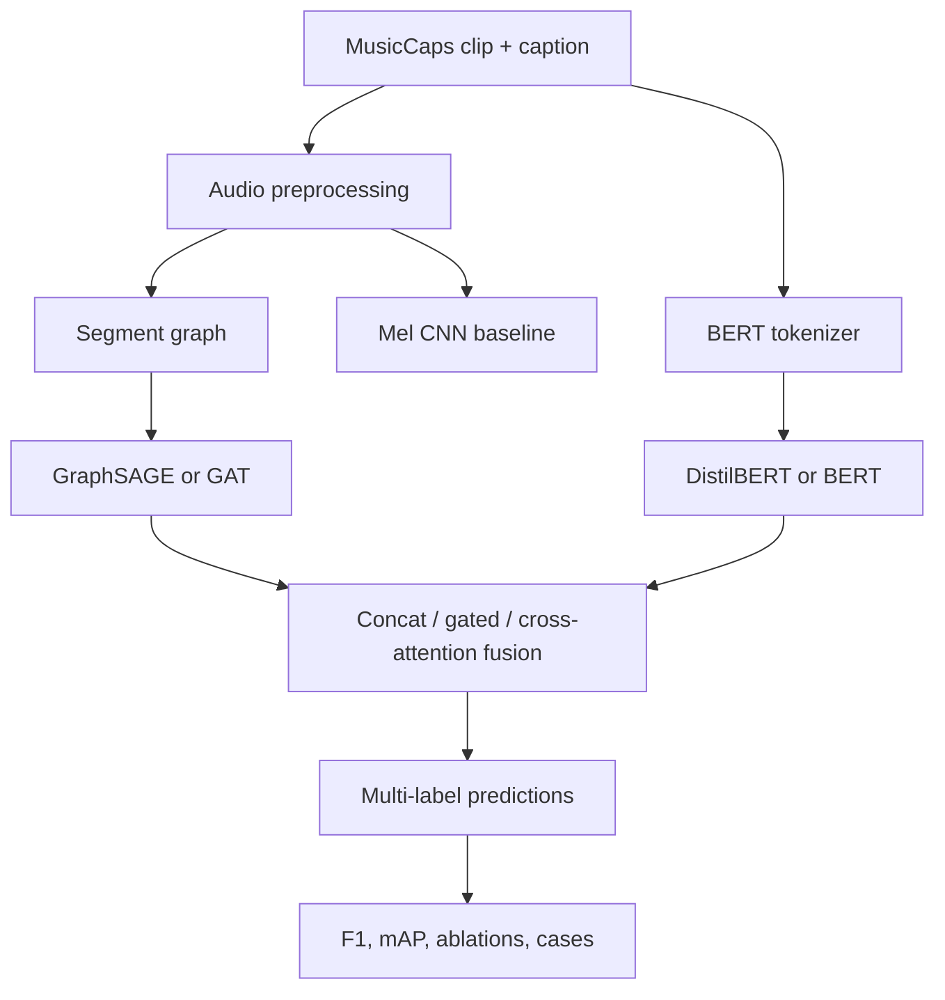

# Academic Project Plan: GNN-Based BERT for Music Context Understanding

Prepared as an end-to-end demonstration of the Academic Project Planner workflow  
Planning date: 29 August 2026  
Proposal deadline: 2 October 2026

## 1. Realistic example user prompt

> I am taking CSE425 Neural Networks and attached the project brief, “GNN-Based BERT for Understanding Context from Music.” The deadline is 2 October 2026. Assume a three-person team, about 10–12 hours per person per week, and access to one 12 GB NVIDIA GPU through a lab or Colab. We know Python, basic CNNs, and signal processing, but have not implemented a GNN project before. Review every requirement in the PDF, search for exact and similar projects, relevant papers, and GitHub repositories, then assess feasibility. Choose a defensible dataset and MVP, explain prerequisites, include a system diagram, split the work into executable parts with estimates and acceptance checks, and give prompts we can use with ChatGPT, Codex, or Claude. Do not invent experimental results.

The team size, weekly hours, and 12 GB GPU are demonstration assumptions, not verified facts about the real user.

## 2. Executive decision

**Verdict: feasible with changes.** Tasks 1–3 plus the required repository, plots, report, graph samples, and inference notebook are feasible by 2 October for the example three-person team. The unmodified proposal is risky because it suggests combining datasets that do not share track-level identities, while the fusion model requires aligned audio, graph, text, and labels for every sample.

**Recommended core scope:** use MusicCaps as one paired source. Each available 10-second clip supplies audio, a caption, an aspect list, and AudioSet labels. Build a graph from short within-clip audio segments, encode the caption with DistilBERT/BERT, and predict a carefully audited top-30 multi-label vocabulary. MusicCaps contains 5,521 annotated rows, but its published file contains YouTube IDs and timestamps rather than redistributed audio; availability must therefore be audited in the first 48 hours. [MusicCaps dataset card](https://huggingface.co/datasets/google/MusicCaps)

**Fallback:** if fewer than 80% of MusicCaps clips are usable, use FMA-small for audio/graph and genre classification, using only non-target textual metadata as BERT input. This is safer operationally but weaker as a multi-label text–audio fusion task. FMA-small is 7.2 GiB with 8,000 30-second tracks and official splits/resources. [Official FMA repository](https://github.com/mdeff/fma)

**MVP boundary:** MusicCaps audit; reproducible preprocessing; BERT-only, GNN-only, CNN, majority/keyword baselines; concatenation fusion; Macro-F1, Micro-F1, mean average precision; three controlled ablations; 20 graph samples; demo notebook; 6–10 page report.

**Full boundary:** add cross-attention fusion, GAT comparison, graph explanation/case studies, and a frozen-encoder contrastive retrieval experiment. Do not add DEAM multitask regression or train a large dual encoder from scratch before the core submission is stable.

**Estimated effort:** 145–215 team-hours for the core; 185–270 hours with the optional retrieval extension. Likely calendar time is 4.5–5 weeks for a three-person team. Solo completion of the full scope would require roughly 30–45 focused hours per week and is not recommended.

## 3. Project understanding and proposal review

The project aims to combine semantic information from text with relational structure derived from music audio. A BERT encoder processes captions, tags, or lyrics; a GraphSAGE/GAT encoder processes a graph whose nodes represent segments/chords/events; and a fusion head predicts genre, mood, tags, or emotion. The work is supervised understanding, not music generation. The proposal defines four escalating tasks: BERT-only, GNN-only, GNN–BERT fusion, and optional contrastive retrieval.

### Explicit requirements

| Requirement | Evidence in supplied proposal | Planned response |
| --- | --- | --- |
| Combine text semantics and a music structure graph | `CSE425_Project_GNN_BERT_Music_Context(1).pdf`, pp. 1–2 | Parts 3–5 implement text, graph, and fusion branches. |
| Use at least one audio and one text/tag source | Proposal, pp. 2–3 | Use paired MusicCaps; obtain instructor approval because the core task examples name FMA/MTAT. |
| Task 1 BERT baseline with F1 curves | Proposal, p. 3 | DistilBERT/BERT plus TF-IDF and keyword controls. |
| Task 2 GraphSAGE/GAT with graph builder and CNN comparison | Proposal, p. 4 | Segment graph with temporal + similarity edges; GraphSAGE first; CNN mel baseline. |
| Task 3 fusion, ablations, t-SNE, cases | Proposal, p. 4 | Concat first, gated/cross-attention next; four-model ablation and three cases. |
| Task 4 contrastive retrieval and R@K | Proposal, p. 5 | Stretch only; frozen encoders/projection heads after core gate. |
| Report Macro/Micro-F1, AUC-PR, regression/retrieval metrics as applicable | Proposal, p. 5 | Core: Macro/Micro-F1 and label-wise AP/mAP; optional: R@1/5/10. |
| At least two baselines | Proposal, pp. 6–7 | Majority/label-prior, TF-IDF text, CNN audio, BERT-only, GNN-only. |
| Avoid leakage; document splits and graph construction | Proposal, pp. 3 and 8 | Track-ID checks, train-only vocabulary/statistics, split manifest, graph audit. |
| GitHub/ZIP, 20 graphs, plots, 6–10 page PDF, demo notebook | Proposal, p. 8 | Parts 1, 2, 6, and 7 trace directly to these outputs. |

### Important proposal warning

Table 3 on proposal page 7 is explicitly illustrative. Its Macro-F1, AUC-PR, MAE, and R@5 values must be replaced by measured results and must never be cited as achieved performance.

## 4. Prior-work fit

Personal-context access surfaced the user’s recent study of self-attention, cross-attention, scaled dot-product attention, and masking. Earlier conversation history also shows Python/data-analysis, DSP, CNN/LSTM, TensorFlow, plotting, and signal-processing experience. No separate ChatGPT Project, repository, or prior GNN–BERT/music implementation was accessible, so none is assumed.

| Category | Current fit | Planning effect |
| --- | --- | --- |
| Already knows | Python basics, data analysis/plotting, DSP and time-frequency concepts, CNN/LSTM fundamentals, recent attention theory | Audio preprocessing and the attention formula need review, not a full introductory course. |
| Partly knows | Deep-learning experimentation, Git/GitHub, transformer concepts | Budget focused practice for PyTorch training loops, Hugging Face, configuration, and reproducibility. |
| Must learn | PyTorch Geometric data objects/batching, graph design, multilabel imbalance and thresholding, cross-modal leakage controls, retrieval metrics, license-aware reuse | These form the prerequisite path for Parts 2–6. |

## 5. Exact-match and similar-work research

Search anchors included the exact title, “GNN–BERT” + music context, BERT/GraphSAGE/audio-text combinations, MusicCaps graph retrieval, FMA + PyTorch Geometric, chord/segment graphs, and contrastive music-language retrieval.

**Exact-match result:** No credible exact public match was found in the searches performed. This is a bounded search result, not a claim that no private or unindexed implementation exists.

| Source | Match class | What it establishes | Safe reuse/adaptation | Important mismatch | Confidence |
| --- | --- | --- | --- | --- | --- |
| [Multi-Faceted Music Retrieval](https://github.com/issacting93/deeplearning-music-rec) | Near match | Combines FMA, CLAP/SBERT, audio embeddings, heterogeneous GraphSAGE, retrieval, fusion, and leakage analysis | Study architecture, shared embedding interfaces, evaluation ideas | Graph is track–artist–genre, not within-track audio structure; SBERT/CLAP rather than required BERT fusion; only 7 commits, no release, no visible license; do not copy code | Medium |
| [MusCALL](https://github.com/ilaria-manco/muscall) | Method match | Official dual-encoder music–language retrieval, zero-shot tagging, and genre evaluation | Study dataset JSON, retrieval evaluation, and training configuration | No GNN; GPL-3.0 code affects derivative redistribution | High |
| [GraphMuse](https://github.com/manoskary/graphmuse) | Method/component match | PyG-based music graphs, batching, graph creation, and music-specific GNN layers | Study graph software design; MIT licensed | Built for symbolic score/MusicXML data, not raw audio segment graphs | High |
| [MusGConv implementation](https://github.com/manoskary/MusGConv) | Method match | Reproducible graph experiments and ablations for music understanding | Study experimental structure; Apache-2.0 | Symbolic pitch/rhythm tasks; not audio-text fusion | High |
| [FMA official code/data](https://github.com/mdeff/fma) | Component match | Official audio, metadata, splits, feature extraction, and baselines | Reuse/adapt MIT code and CC BY 4.0 metadata with citation; preserve per-track audio licenses | Original environment targets Python 3.6 and old dependencies | High |
| [LAION-CLAP](https://github.com/LAION-AI/CLAP) | Component/method match | Pretrained audio–text embeddings and contrastive baseline | Reuse as an attributed optional baseline; repo is CC0-1.0 and supported in Transformers | Does not satisfy the required GNN branch and can overshadow the intended BERT learning objective | High |
| [MusicCaps downloader example](https://github.com/nateraw/download-musiccaps-dataset) | Component match | Small Apache-2.0 script/notebook for IDs, timestamps, yt-dlp, ffmpeg, and torchaudio | Adapt downloader logic after policy/license review | Audio availability and platform terms remain external risks | Medium-high |

## 6. Papers that affect the design

| Paper | Main design lesson | Direct relevance and limitation |
| --- | --- | --- |
| Devlin et al., 2019, [BERT](https://aclanthology.org/N19-1423/), DOI `10.18653/v1/N19-1423` | Bidirectional pretrained text representations can be adapted with a task head | Supports the text branch; it does not justify using labels/tags as both input and target. |
| Hamilton et al., 2017, [GraphSAGE](https://arxiv.org/abs/1706.02216) | Learn an inductive neighborhood aggregation function from node features | Supports GraphSAGE; the usefulness of the chosen music graph still requires ablation. |
| Defferrard et al., 2017, [FMA](https://arxiv.org/abs/1612.01840) | Provides official splits, metadata, features, Creative Commons audio, and genre baselines | Strong fallback dataset; text fields are not clean captions and can leak target information. |
| Agostinelli et al., 2023, [MusicLM/MusicCaps](https://arxiv.org/abs/2301.11325), DOI `10.48550/arXiv.2301.11325` | Releases 5.5k expert-described music–text pairs | Best small aligned source; only IDs/timestamps are published, so audio availability must be audited. |
| Wu et al., 2023, [large-scale CLAP](https://arxiv.org/abs/2211.06687) | Contrastive audio/text encoders support retrieval and zero-shot classification | Strong Task 4 baseline; full pretraining used far more data than this course project has. |
| Doh et al., 2023, [universal text-to-music retrieval](https://arxiv.org/abs/2211.14558), DOI `10.48550/arXiv.2211.14558` | Tag and sentence queries need compatible representations and evaluation | Motivates separate tag/sentence tests and a retrieval extension; no graph branch. |
| Karystinaios et al., 2024, [MusGConv](https://dl.acm.org/doi/10.24963/ijcai.2024/850), DOI `10.24963/ijcai.2024/850` | Music-informed graph inductive bias and controlled graph ablations can improve symbolic tasks | Justifies testing musically meaningful edges; findings cannot be transferred directly from symbolic scores to noisy raw-audio graphs. |

## 7. Dataset and model decision

### Primary route: MusicCaps, subject to a 48-hour gate

The dataset card reports 5,521 rows with 10-second AudioSet clips, free-text captions, aspect lists, AudioSet labels, author IDs, and train/eval flags. The CSV is CC BY-SA 4.0, while audio must be retrieved from the referenced YouTube IDs and timestamps. [MusicCaps fields and usage](https://huggingface.co/datasets/google/MusicCaps)

Use the following representation:

- `X_text`: caption tokens, maximum length 128. Do not concatenate the target aspect list.
- `X_audio`: mono 22,050 Hz waveform and log-mel/chroma/MFCC features.
- `G`: 0.5–1.0 second segment nodes; temporal edges plus symmetric top-k similarity edges.
- `y`: top-30 canonical labels selected using training data only, with a documented synonym map and minimum support.

Run a lexical-overlap audit between captions and target labels. Because aspect lists and captions describe the same clip, a keyword/TF-IDF baseline may be strong. Report that honestly; it is evidence about the task, not a reason to hide the baseline.

### Graph design

Use a segment graph instead of automatic chord labels for the core. Chord extraction adds an additional error-prone subsystem and can consume the schedule without improving the graded comparison.

- Node features: per-segment log-mel mean/std, 12-bin chroma, 20 MFCCs and deltas, energy, spectral centroid, and zero-crossing rate; standardize using training statistics only.
- Edges: bidirectional temporal adjacency, plus top-2 or top-3 cosine-similar non-adjacent nodes; add self-loops in the model.
- Required ablations: temporal-only, temporal + similarity, random/shuffled similarity edges, and no-graph pooled MLP/CNN.
- Graph audit: no NaNs; bounded node/edge counts; graph connected through temporal edges; deterministic build; 20 rendered examples.

Top-k edges are preferable to a fixed unvalidated cosine threshold because they control graph density across quiet, dense, and noisy clips.

### Fusion sequence

1. Concatenation `z = [g; t]` with frozen or mostly frozen encoders.
2. Gated fusion if concatenation is stable.
3. One-way graph-query-to-text-token cross-attention only if validation improves.

The proposal’s single graph-level query can attend to text tokens, but on 5.5k examples it may overfit. Cross-attention is therefore an experimental model, not the first implementation.



Assumption: each graph and caption refers to the same 10-second clip. No cross-dataset fusion is attempted unless there is a verified track-level mapping.

## 8. Feasibility assessment

| Dimension | Assessment | Decision |
| --- | --- | --- |
| Technical | Standard PyTorch, Transformers, librosa, and PyG components exist; graph validity is the main research uncertainty | Feasible with staged baselines and ablations. |
| Data | MusicCaps is aligned but audio retrieval is fragile; label vocabulary is long-tailed and noisy | Mandatory 48-hour availability/label audit; FMA fallback. |
| Compute | Estimated feasible on one 12 GB GPU with mixed precision, cached BERT/features, small batches, and frozen layers | Do not fine-tune two large encoders end-to-end initially. |
| Schedule | 34 days remain from 29 August to 2 October | Core Tasks 1–3 first; Task 4 only after a 22 September gate. |
| Storage | MusicCaps contains about 15.3 hours of 10-second audio; decoded mono 22.05 kHz 16-bit audio is roughly 2.4 GB before overhead | Allow 10–20 GB for audio, features, caches, checkpoints, and plots. |
| Budget | Open-source software and free/lab compute can be sufficient | Avoid paid APIs and lyrics services in the core. |
| Ethical/legal | Captions/CSV have a stated license; referenced audio has separate rights/platform constraints | Store only permitted files, do not publish raw audio, record licenses and attribution. |
| Academic integrity | Public code can accelerate learning but may not be submitted as original work | Cite all reused logic; retain original commits, tests, and experimental responsibility. |

### Critical path

Dataset access and split audit → deterministic graph builder → BERT/GNN baselines → stable fusion → ablation runs → figures/report/demo.

### Top risks and gates

| Risk | Probability / impact | Early warning | Mitigation and fallback |
| --- | --- | --- | --- |
| MusicCaps clips unavailable | Medium / high | <80% successful retrieval in a 200-ID sample | Full audit by day 2; pivot to FMA-small if threshold fails. |
| Text-to-label lexical leakage | High / high | Keyword/TF-IDF baseline nearly matches BERT | Report it; normalize labels; use AudioSet labels or a broader canonical taxonomy; add overlap-stratified analysis. |
| GNN gains come only from extra parameters | Medium / high | Temporal/random-edge graphs perform the same | Equalize parameter budgets; include no-graph pooled baseline and edge ablations. |
| Cross-attention overfits | Medium / medium | Training improves while validation Macro-F1 falls | Freeze encoders, add dropout/early stopping, keep concat as accepted core. |
| Label imbalance makes Macro-F1 unstable | High / medium | Rare labels have zero positives in a split | Train-only support threshold; iterative stratification; report per-label support/AP. |
| Reproducibility postponed | Medium / high | Only notebooks work by 20 September | CLI pipeline, config, seed manifest, and smoke tests from week 1. |
| Optional work displaces report | High / high | Core ablations incomplete on 22 September | Cancel Task 4 and spend the final 10 days on evidence and writing. |

## 9. Prerequisite map

Learn only what unlocks the next deliverable:

1. **Multilabel formulation:** sigmoid + BCEWithLogitsLoss, class imbalance, validation-only threshold selection, Macro/Micro-F1, AP/mAP.
2. **PyTorch workflow:** Dataset/DataLoader, device handling, AMP, checkpointing, deterministic seeds, early stopping.
3. **Hugging Face BERT:** tokenizer, attention mask, pooled representation, frozen versus partial fine-tuning. [Official BERT documentation](https://huggingface.co/docs/transformers/en/model_doc/bert)
4. **Audio features:** log-mel, chroma, MFCC, beat/segment aggregation, train-only normalization. [librosa tutorial](https://librosa.org/doc/0.11.0/tutorial.html)
5. **Graph basics:** node-feature matrix, edge index, graph batching, message passing, global mean pooling, GraphSAGE. [PyG SAGEConv documentation](https://pytorch-geometric.readthedocs.io/en/2.8.0/generated/torch_geometric.nn.conv.SAGEConv.html)
6. **Fusion and attention:** dimensional projections, concatenation, gated fusion, single-query cross-attention, regularization.
7. **Evaluation discipline:** leakage, stratification, fixed test set, ablation tables, paired seed reporting, error analysis. For PR summaries, distinguish average precision from trapezoidal PR-AUC. [scikit-learn average precision](https://scikit-learn.org/stable/modules/generated/sklearn.metrics.average_precision_score.html)

## 10. Part-by-part execution roadmap

### Part 1 — Scope approval and data viability gate

- **Outcome:** approved dataset/task interpretation and a written go/no-go decision.
- **Why now:** every model depends on aligned audio, text, and targets.
- **Prerequisites:** proposal, MusicCaps card, storage/compute access, instructor contact.
- **Steps:**
  1. Convert the proposal into a one-page requirement checklist.
  2. Ask the instructor to approve MusicCaps for Tasks 1–3, with Task 4 optional.
  3. Download the CSV and audit 200 random IDs, then all IDs if the pilot is acceptable.
  4. Count candidate labels, support, caption overlap, duplicate IDs, and failed clips.
  5. Freeze the route: MusicCaps if ≥80% usable; otherwise FMA-small fallback.
- **Inputs/tools/human decisions:** PDF, Hugging Face/Kaggle metadata, ffmpeg/yt-dlp where permitted; the user/team owns instructor approval.
- **Deliverables:** `docs/scope.md`, `results/data_audit.json`, failure log, label-frequency plot, signed-off dataset decision.
- **Acceptance checks:** no unresolved input/target ambiguity; usable-count threshold met; license/attribution note written; fallback tested on 20 samples.
- **Time:** 8–12 team-hours; 2 elapsed days.
- **Risk/fallback:** missing audio → FMA-small; instructor rejects MusicCaps core → use the exact dataset/task they approve.
- **References:** proposal pp. 2–5; MusicCaps dataset card; FMA official repository.
- **Assistant prompt:**

```text
Review Part 1 of our CSE425 GNN–BERT music project. Inputs: the proposal PDF, MusicCaps CSV audit, failed-download log, label counts, and the instructor’s reply. Decide MusicCaps vs FMA-small using explicit thresholds. Produce docs/scope.md and results/data_audit.json. Check audio/text/label alignment, duplicates, label support, lexical overlap, license constraints, and storage. Do not download or redistribute content without authorization, and do not invent availability counts.
```

### Part 2 — Reproducible repository, splits, features, and graphs

- **Outcome:** one command converts permitted raw inputs into cached features and PyG graphs.
- **Why now:** all models need identical IDs, labels, and splits.
- **Prerequisites:** Part 1 route and label vocabulary.
- **Steps:**
  1. Create the proposal’s repository layout plus `tests/`, `docs/`, and `scripts/`.
  2. Pin Python and package versions; add `config.yaml`, seeds, and environment instructions.
  3. Create train/validation/test manifests with no duplicate track IDs; compute labels/statistics from train only.
  4. Implement audio loading/resampling and segment features.
  5. Build temporal + top-k similarity graphs, plus temporal-only/random-edge variants.
  6. Render and inspect at least 20 graph samples.
- **Inputs/tools/human decisions:** PyTorch, PyG, librosa, pandas, pytest; team chooses label mapping and segment length based on the audit.
- **Deliverables:** split JSONs, vocabulary/mapping, feature cache, ≥20 `.pt`/`.json` graphs, graph plots, preprocessing tests.
- **Acceptance checks:** deterministic hashes; zero train/test ID overlap; no NaNs; temporal connectivity; bounded graph density; 20 samples load in PyG.
- **Time:** 24–36 team-hours; 4–6 days.
- **Risk/fallback:** slow preprocessing → cache per clip and resume; unstable similarity edges → temporal-only graph remains valid.
- **References:** proposal pp. 2–3 and p. 8; librosa/PyG official docs.
- **Assistant prompt:**

```text
Implement Part 2 in the existing repository. Preserve unrelated changes. Build deterministic MusicCaps preprocessing at 22,050 Hz: 0.5–1.0 s nodes, log-mel/chroma/MFCC summary features, temporal edges, symmetric top-k similarity edges, and PyG Data objects. Compute normalization and label vocabulary from train only. Add tests for duplicate IDs, NaNs, graph connectivity, node/edge bounds, and deterministic output. Provide commands for a 20-sample smoke test and full preprocessing. Do not fabricate audio or results.
```

### Part 3 — Text baselines and BERT task

- **Outcome:** reproducible text-only results and evidence about lexical leakage.
- **Why now:** validates labels and establishes Task 1 before multimodal complexity.
- **Prerequisites:** frozen splits/vocabulary.
- **Steps:**
  1. Implement label-prior, keyword-overlap, and TF-IDF one-vs-rest baselines.
  2. Implement DistilBERT/BERT with BCEWithLogitsLoss.
  3. Compare frozen encoder, last-two-layer fine-tuning, and full fine-tuning only if compute permits.
  4. Tune label thresholds on validation only; record Macro/Micro-F1 and per-label AP.
  5. Save five honest successes/failures and training curves.
- **Inputs/tools/human decisions:** Transformers, scikit-learn, captions, target labels; team decides which fine-tuning depth survives validation.
- **Deliverables:** Task 1 checkpoint, configs, metrics JSON, curves, overlap/error analysis.
- **Acceptance checks:** test set untouched until config freeze; all baselines run; metrics recompute from saved predictions; no target field in input.
- **Time:** 18–26 team-hours; 3–4 days.
- **Risk/fallback:** BERT overfits → freeze most layers/use DistilBERT; keyword baseline dominates → report task leakage and refine labels.
- **References:** proposal p. 3; BERT paper and official Transformers docs.
- **Assistant prompt:**

```text
Build Task 1 using the fixed manifests. Include label-prior, keyword, TF-IDF logistic regression, frozen DistilBERT, and partial fine-tuning. Use BCEWithLogitsLoss, validation-only threshold selection, early stopping, and saved prediction files. Report Macro-F1, Micro-F1, per-label AP/mAP, support, five successes, and five failures. Verify that aspect_list/target labels never enter the caption input. Generate curves from logged data only.
```

### Part 4 — Audio CNN and graph baselines

- **Outcome:** fair Task 2 comparison showing whether graph structure adds value.
- **Why now:** fusion is uninterpretable until the audio and graph branches work independently.
- **Prerequisites:** graphs/features and frozen evaluation protocol.
- **Steps:**
  1. Train label-prior/MLP pooled-feature baseline.
  2. Train a compact CNN on log-mel spectrograms with similar parameter budget.
  3. Train two-layer GraphSAGE with global mean + max pooling.
  4. Compare temporal-only, temporal+similarity, and random-edge graphs.
  5. Inspect attention/edge/path cases only after quantitative evaluation.
- **Inputs/tools/human decisions:** PyTorch/PyG, cached mel/features/graphs; team chooses hidden size by validation.
- **Deliverables:** CNN and GNN checkpoints, ablation table, graph examples, parameter/runtime table.
- **Acceptance checks:** identical splits/labels; three seeds for the selected models if time permits; random-edge control; reproducible saved predictions.
- **Time:** 28–40 team-hours; 5–7 days.
- **Risk/fallback:** GNN does not beat CNN → report negative result and graph-coherence analysis; that is academically valid.
- **References:** proposal p. 4 and pp. 6–7; GraphSAGE paper; PyG docs; MusGConv as a design lesson, not a direct audio claim.
- **Assistant prompt:**

```text
Implement fair audio-only baselines on the fixed splits: pooled-feature MLP, compact mel CNN, and two-layer GraphSAGE. Evaluate temporal-only, temporal+top-k-similarity, and random-edge graphs while keeping hidden size and parameter counts comparable. Save predictions, run metadata, seeds, parameter counts, runtime, Macro/Micro-F1, and mAP. If GraphSAGE loses, diagnose graph density, feature quality, and oversmoothing without altering the test set.
```

### Part 5 — GNN–BERT fusion and controlled ablations

- **Outcome:** stable fusion model plus evidence for or against each fusion mechanism.
- **Why now:** both unimodal branches and evaluation code are already validated.
- **Prerequisites:** selected BERT and GNN checkpoints.
- **Steps:**
  1. Freeze encoders and train concatenation fusion.
  2. Unfreeze only projection/head layers if validation supports it.
  3. Add gated fusion, then single-query cross-attention as the advanced comparison.
  4. Run BERT-only, GNN-only, concat, gated/cross-attention ablations.
  5. Create three case studies tracing graph segments and influential text tokens; describe them as model evidence, not causal proof.
- **Inputs/tools/human decisions:** selected checkpoints, saved embeddings, fusion config; team decides whether cross-attention earns inclusion.
- **Deliverables:** fusion checkpoints, ablation table, t-SNE/embedding plot, three cases, failure analysis.
- **Acceptance checks:** concat beats or meaningfully complements one branch on validation, or the negative result is explained; dimensions/masks tested; no test-driven selection.
- **Time:** 28–44 team-hours; 5–7 days.
- **Risk/fallback:** unstable fusion → keep frozen-encoder concat as the core Task 3 implementation.
- **References:** proposal pp. 4 and 7–8; BERT/GraphSAGE sources.
- **Assistant prompt:**

```text
Using the selected frozen BERT and GraphSAGE checkpoints, implement fusion in three stages: concatenation, gated fusion, and graph-query-to-text-token cross-attention. Add unit tests for tensor shapes, masks, batches, and gradient flow. Run the exact ablation matrix BERT-only/GNN-only/concat/gated/cross-attention with validation-only model selection. Produce measured tables, an embedding visualization, and three evidence-grounded cases. Do not claim attention is a causal explanation.
```

### Part 6 — Evaluation, robustness, and optional retrieval gate

- **Outcome:** final, auditable experimental evidence and a decision on Task 4.
- **Why now:** all core models exist; this part prevents cherry-picking.
- **Prerequisites:** saved predictions and run manifests.
- **Steps:**
  1. Recompute all metrics from prediction files.
  2. Add per-label support/AP, threshold sensitivity, and seed variability.
  3. Compare errors by tag family, audio quality, caption length, and graph density.
  4. Freeze the core table by 22 September.
  5. Only if all core acceptance checks pass, add frozen audio/text encoders with projection heads and InfoNCE; evaluate R@1/5/10 in both directions and compare with CLAP zero-shot.
- **Inputs/tools/human decisions:** result files, scikit-learn, plotting tools; team owns the Task 4 go/no-go decision.
- **Deliverables:** final metrics JSON/CSV, robustness plots, ablation table, optional retrieval table/examples.
- **Acceptance checks:** every table cell traces to a run; no proposal placeholders; test evaluated once per frozen configuration; optional work cannot delay core documentation.
- **Time:** 18–28 core hours; +25–40 optional hours; 3–6 days.
- **Risk/fallback:** too few retrieval pairs/compute → use pretrained CLAP only as a cited reference baseline or omit Task 4.
- **References:** proposal pp. 5–7; CLAP and universal retrieval papers; scikit-learn metrics docs.
- **Assistant prompt:**

```text
Audit all saved predictions and run manifests. Recompute Macro-F1, Micro-F1, per-label AP/mAP, support, threshold sensitivity, and seed mean/std. Generate the final ablation and robustness tables with traceable run IDs. Check that proposal Table 3 placeholder numbers are absent. Then apply the 22 September gate: recommend Task 4 only if core models, tests, plots, and demo are complete. If approved, use frozen encoders plus small projection heads and InfoNCE; report bidirectional R@1/5/10.
```

### Part 7 — Reproducibility, report, presentation assets, and demo

- **Outcome:** submission-ready repository/ZIP, 6–10 page report, graph samples, plots, and one-click demo.
- **Why now:** documentation is 20% of the task-level rubric and report/presentation is 10% of the final rubric.
- **Prerequisites:** frozen scope, code, and final metrics.
- **Steps:**
  1. Add a clean README, exact install/run commands, data instructions, licenses, seeds, and expected outputs.
  2. Run a clean-environment smoke test from raw metadata to one inference.
  3. Build `notebooks/demo_context.ipynb` around one honest example.
  4. Write the 6–10 page paper: problem, related work, data, method, experiments, ablations, limitations, ethics, conclusion.
  5. Verify all plots, citations, filenames, and repository links; remove secrets and raw restricted audio.
- **Inputs/tools/human decisions:** repository, final results, Overleaf template; humans own prose accuracy and submission.
- **Deliverables:** final repository/ZIP, ≥20 graph samples, plots, demo notebook, final PDF, brief presentation figures.
- **Acceptance checks:** clean clone installs; smoke test passes; demo runs end-to-end; report numbers equal metrics files; no secrets/raw disallowed audio; all reused code/data attributed.
- **Time:** 25–37 team-hours; 5–7 days including revision.
- **Risk/fallback:** environment drift → provide a tested lock file/container and a CPU smoke-test subset.
- **References:** proposal pp. 7–9; every paper/repository cited above.
- **Assistant prompt:**

```text
Prepare the final CSE425 submission from the existing repository and frozen result files. Do not change measured values. Create a reproducible README, license/attribution section, data-acquisition instructions, clean-environment smoke test, and notebooks/demo_context.ipynb. Draft a 6–10 page IEEE/NeurIPS-style report with direct citations, method diagram, ablations, limitations, ethics, and exact run IDs behind every table. Scan for secrets, missing files, placeholder metrics, and restricted raw audio before packaging.
```

## 11. Calendar plan to 2 October 2026

| Dates | Primary milestone | Exit condition |
| --- | --- | --- |
| 29–31 Aug | Part 1: scope and dataset gate | Dataset approved; ≥80% availability or fallback selected |
| 1–5 Sep | Part 2: splits, features, graphs | 20 audited graphs; deterministic preprocessing/tests |
| 6–9 Sep | Part 3: text baselines/BERT | Frozen Task 1 result set |
| 10–15 Sep | Part 4: CNN/GNN | Fair audio/graph ablation table |
| 16–21 Sep | Part 5: fusion | Stable concat plus selected advanced fusion |
| 22–24 Sep | Part 6: final core evaluation | Core table frozen; Task 4 go/no-go |
| 25–29 Sep | Part 7: report/demo/reproducibility | Clean-clone smoke test; report draft complete |
| 30 Sep–1 Oct | Buffer and final QA | All submission checks pass |
| 2 Oct | Submission | Uploaded artifacts verified |

## 12. Human and AI task ownership

| Work item | ChatGPT | Codex | Claude | Other software/service | User/team validation |
| --- | --- | --- | --- | --- | --- |
| Literature/dataset synthesis | Can search, compare, and draft with citations | Can turn decisions into repo docs | Can review long-form coherence | Web indexes, publisher pages | Verify source relevance and instructor expectations |
| Repository implementation | Can explain modules and review snippets | Can implement, run tests, debug, and preserve existing changes when repo/data are available | Can review architecture/code | Git, PyTorch, PyG, HF, librosa | Approve interfaces and own submitted code |
| Data download/licensing | Can identify requirements and risks | Can automate permitted downloads/checks | Can review data statements | HF/Kaggle, ffmpeg, yt-dlp, storage | Human-only authorization, policy compliance, and license decisions |
| Model training | Can suggest configs and interpret logs | Can run training if compute/data are accessible | Can compare logs and hypotheses | Local/lab/Colab GPU, optional W&B | Confirm actual execution and retain logs/checkpoints |
| Physical/subjective listening | Can draft rating form | Can prepare sampling/export tools | Can summarize supplied ratings | Audio player/survey tool | Human-only listening and consent; minimum five listeners if Task 4 evaluation is used |
| Metrics and plots | Can define/critique metrics | Can compute from saved predictions and test code | Can review statistical interpretation | scikit-learn/matplotlib | Verify that plots/tables match artifacts |
| Final report | Can draft sections/citations | Can assemble reproducible figures and check consistency | Can edit long-form argument | Overleaf/LaTeX | Final academic responsibility, authorship, and submission |

No AI assistant may claim a training run, measurement, listening result, or clean-environment test unless it actually ran or observed it.

## 13. Direct recommendation

Start with the 48-hour MusicCaps availability and leakage audit. Ask the instructor one precise question: “May we use MusicCaps as the paired dataset for Tasks 1–3 so every graph, caption, and label refers to the same clip, while keeping Task 4 optional?” If approved and ≥80% of clips are usable, continue with the MusicCaps plan. Otherwise switch immediately to FMA-small and simplify targets rather than losing a week to data alignment.

### Compact final summary

- **Problem/solution:** infer music context by fusing a BERT caption representation with a GNN over within-clip audio segments.
- **Academic contribution:** test whether temporal/similarity graph edges add value beyond text, pooled audio, and a CNN under leakage-controlled ablations.
- **Scope:** core Tasks 1–3, two-plus baselines, reproducible artifacts; contrastive retrieval only as a gated stretch.
- **Time/main risk:** 145–215 team-hours over 4.5–5 weeks; paired-data availability and text-label leakage are the critical risks.
- **Immediate action:** complete Part 1 by 31 August and freeze the dataset/scope before writing model code.

