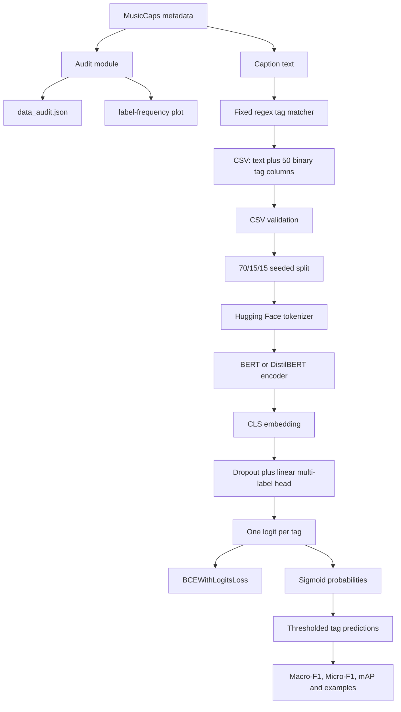

# Task 1 - Architecture, workflow, and run guide

This guide covers the standalone Task 1 BERT baseline. The notebook-first entry
point is `notebooks/task1_bert_baseline.ipynb`. Active code lives in
`src/task1/`; offline tests live in `tests/task1/`; generated outputs go to
`results/task1/`. `Task1_test/` is a frozen copy of the original measured run.

## Run in Jupyter or VS Code

1. Open `notebooks/task1_bert_baseline.ipynb`.
2. Select the project Python environment/kernel.
3. Run all cells. The notebook uses the internally consistent frozen BERT-base
   artifacts for review and inference.
4. Set `RUN_TRAINING = True` to enable training: 10 epochs when CUDA is
   available and 2 full fine-tuning epochs on CPU. The run writes to
   `results/task1/notebook_run/` and does not overwrite frozen results.

The notebook detects if a checkpoint and metrics file describe different model
families, visualizes label support and F1 history, shows five saved examples,
runs new inference, and explains the proxy-task leakage.

## What Task 1 does

Task 1 receives a natural-language music caption and predicts multiple tags
such as `guitar`, `vocals`, `rock`, `calm`, or `piano`. Each tag is an
independent binary target, so one caption may have many positive tags.

The current dataset is a **caption-to-tag proxy task**. `data.py` creates labels
by matching a fixed vocabulary of genre, mood, instrument, and production terms
against the same caption used as model input. This is allowed by the supplied
project brief as a MusicCaps proxy task, but it creates direct lexical leakage.
The very high saved F1 scores measure how well BERT recovers those proxy rules;
they are not evidence that the model listened to or understood audio.

## Package layout

| File | Responsibility |
| --- | --- |
| `src/task1/audit.py` | Validate MusicCaps fields, duplicates, label support, lexical overlap, storage, and optional clip availability without downloading audio |
| `src/task1/data.py` | Load MusicCaps metadata, match the fixed tag vocabulary, and write the multi-hot CSV |
| `src/task1/train.py` | Validate data, split it, tokenize captions, train BERT, evaluate, checkpoint, plot F1, and save five examples |
| `src/task1/predict.py` | Reconstruct the tokenizer/model from checkpoint metadata and predict tags for new captions |
| `tests/task1/test_audit.py` | Test audit parsing, normalization, overlap checks, and availability-gate logic |
| `tests/task1/test_pipeline.py` | Test proxy labels, CSV schema, split integrity, metrics, and preserved artifacts |

`src/bert_encoder.py` stays in the shared source directory because Tasks 2-3
reuse it through the multimodal pipeline. The standalone Task 1 classifier is
defined in `src/task1/train.py` so its checkpoint is self-contained.

## Architecture



Tensor flow for a batch of size `B`, token length `L`, hidden size `H`, and
`K` tags:

```text
input_ids, attention_mask   [B, L]
        |
        v
BERT last_hidden_state      [B, L, H]
        |
        +-- select token 0 (CLS)
        v
caption embedding           [B, H]
        |
        +-- dropout -> linear(H, K)
        v
logits                      [B, K]
        |
        +-- BCEWithLogitsLoss(logits, multi_hot_targets)
        +-- sigmoid(logits) -> probabilities -> threshold -> tags
```

## How each stage works

### 1. Audit

`audit.py` checks the official fields, missing values, duplicate IDs/windows,
caption duplicates, durations, aspect and AudioSet-label frequencies, and exact
caption/aspect overlap. With `--probe-count`, it uses yt-dlp metadata extraction
with `skip_download=True`; it does not save audio. Technical platform errors are
kept separate from confirmed private/unavailable clips.

### 2. Proxy-label preprocessing

`data.py` applies case-insensitive regular expressions from `TAG_VOCAB` to each
caption. Examples include `hip-hop|rap -> hip hop` and
`calm|peaceful|soothing -> calm`. It ranks matched tags by frequency, keeps the
requested top `K`, creates one 0/1 column per tag, and normally drops captions
with no matched tag.

### 3. Training

`train.py` rejects missing text, non-binary labels, and duplicate captions. It
creates a deterministic 70% train, 15% validation, and 15% test split using seed
42. The tokenizer pads/truncates captions to 128 tokens. The model takes the
first output token as the caption representation, applies dropout and a linear
layer, and optimizes binary cross-entropy with logits. BERT and the classifier
head use separate learning rates. Validation Macro-F1 selects the checkpoint;
patience-based early stopping prevents unnecessary epochs.

### 4. Evaluation and inference

After training, the best checkpoint is restored and evaluated once on the test
split. The code saves Macro/Micro-F1, mean average precision, per-tag precision,
recall, F1, support and AP, the training history, an F1 curve, split indices,
and five predictions. `predict.py` reads the model name, tag order, maximum
length, and threshold from the checkpoint so inference uses the training setup.

## Setup

From the repository root:

```powershell
python -m venv .venv
.venv\Scripts\Activate.ps1
python -m pip install -r requirements.txt
```

A CUDA GPU is strongly recommended for BERT training. Audit, preprocessing,
tests, and small inference calls can run on CPU.

## Run commands

### Show available modules

```powershell
python -m src.task1
```

### A. Reproduce the metadata audit

Metadata-only audit:

```powershell
python -m src.task1.audit --hf-dataset --probe-count 0
```

Deterministic 200-ID availability pilot, without downloading media:

```powershell
python -m src.task1.audit --hf-dataset --probe-count 200 --seed 42
```

Main outputs:

- `results/data_audit.json`
- `results/musiccaps_availability_failures.jsonl`
- `results/plots/musiccaps_label_frequency.png`

Large unauthenticated availability scans may trigger YouTube throttling. A bot
or sign-in challenge is a technical error, not proof that a clip is unavailable.

### B. Build the proxy-tag CSV

```powershell
python -m src.task1.data `
  --hf-dataset `
  --top-k 50 `
  --output data/processed/musiccaps_tags.csv
```

To use an existing CSV instead of Hugging Face:

```powershell
python -m src.task1.data `
  --input-csv path/to/musiccaps.csv `
  --caption-col caption `
  --top-k 50 `
  --output data/processed/musiccaps_tags.csv
```

### C. Train and evaluate

Recommended first run with DistilBERT:

```powershell
python -m src.task1.train `
  --data-path data/processed/musiccaps_tags.csv `
  --model-name distilbert-base-uncased `
  --output-dir results/task1 `
  --batch-size 16 `
  --epochs 10 `
  --patience 3 `
  --seed 42
```

Use `--freeze-bert` for a faster frozen-encoder baseline. Use
`--device cuda` to require a GPU or leave the default `auto` selection.

Training writes:

```text
results/task1/
  best_model.pt
  split_indices.json
  metrics.json
  f1_curve.png
  example_predictions.json
```

### Latest notebook training run

The notebook was trained on the available CPU with DistilBERT for two epochs.
Its artifacts are in `results/task1/notebook_run/`. The best checkpoint was
selected at epoch 2 with validation Macro-F1 `0.5383`. On the 795-example
held-out test split it reached Macro-F1 `0.5527`, Micro-F1 `0.8771`, and mean
area under the precision-recall curve `0.7320` at threshold `0.5`.

These scores measure the proxy-label task described below; they must not be
interpreted as leakage-free music understanding results.

### D. Predict new captions

```powershell
python -m src.task1.predict `
  --checkpoint results/task1/best_model.pt `
  --text "calm acoustic guitar with soft vocals" `
  --top-k 5
```

Repeat `--text` to infer a batch.

### E. Run tests

```powershell
python -m unittest discover -s tests -v
```

The tests are offline. They do not retrain BERT or download MusicCaps.

## Reading the outputs correctly

Training rejects invalid epoch, batch, patience, threshold, and split settings
before writing artifacts. In `--freeze-bert` mode, encoder dropout stays disabled
while the classifier head trains. Average precision includes labels present in
every evaluation sample (AP = 1); labels with no positives are excluded from its
mean. These corrections apply to new runs; historical saved metrics are unchanged.

- `metrics.json` is the authoritative record of configuration, history, split
  sizes, aggregate metrics, and per-tag metrics.
- `split_indices.json` makes the random partition reproducible for the exact
  same input CSV ordering.
- `best_model.pt` contains weights plus model/tag metadata for inference.
- `f1_curve.png` is generated only from logged train/validation history.
- `example_predictions.json` contains the first five test examples, their
  highest probabilities, and proxy targets.

## Important limitations and next improvements

1. Targets are deterministic keyword matches from the input text, so the proxy
   task has direct target leakage.
2. The top-50 proxy vocabulary is selected before the split. A publishable
   experiment must fit its vocabulary and normalization on training data only.
3. The split is deterministic and disjoint but not iterative multi-label
   stratification.
4. The default threshold is 0.5. The project plan calls for validation-only
   threshold selection and comparison against label-prior, keyword, and TF-IDF
   baselines.
5. Negation is not modeled: text such as "no vocals" can still create a positive
   `vocals` proxy target.

Treat this implementation as a verified Task 1 pipeline baseline. Use
independent annotations or a leakage-controlled target construction before
claiming general music-context understanding.
